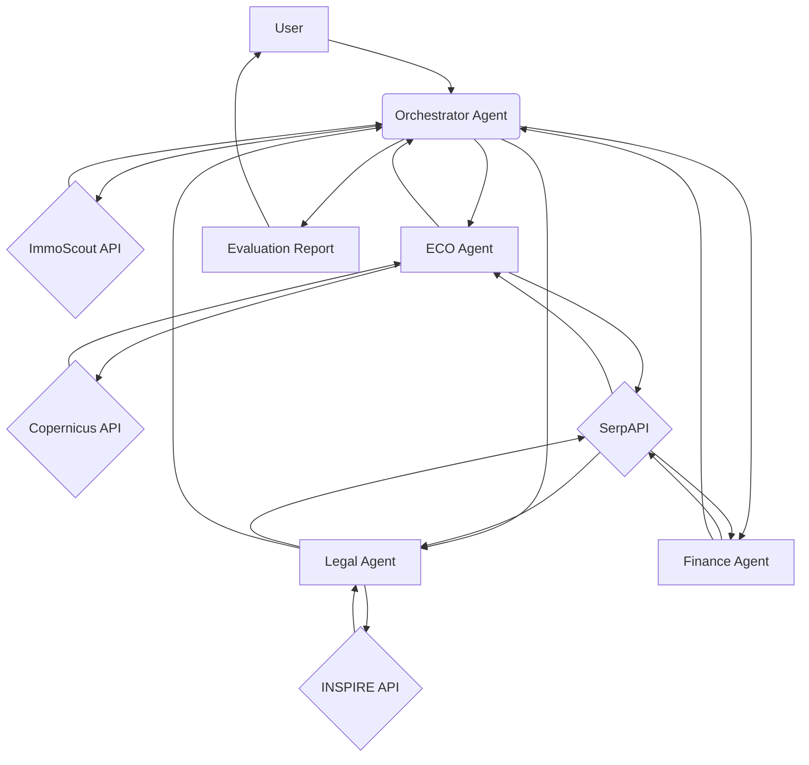

-----

# Greenzero Land Scouting Agent (`Flächensuch-Agent`)

## 🌍 Mission Overview

Greenzero is dedicated to ecological rebuilding and sustainable land use. A key part of their business is identifying and acquiring land with high potential for ecological restoration, biodiversity enhancement, and climate impact mitigation.

This project, the **Land Scouting Agent**, is an autonomous AI system designed to streamline and enhance Greenzero's land acquisition pipeline. By systematically scouting, evaluating, and prioritizing land listings from a conversational interface, this system enables Greenzero to make faster, data-driven decisions that align with its ecological and financial goals.

This solution demonstrates how multi-agent AI architectures can augment decision-making in sustainable land investment, fulfilling the core requirements of the AI Automation Engineer role.

-----

## 🎯 System Goals

The primary goal of this project is to build a `Flächensuch-Agent` that:

1.  **Scouts on Command**: Explores land listings from ImmoScout24 via a chat interface.
2.  **Evaluates Holistically**: Assesses each promising property from three critical perspectives: ecological potential, legal compliance, and financial feasibility.
3.  **Provides Actionable Insights**: Produces a structured, transparent evaluation for each property that Greenzero can use to prioritize acquisitions.
4.  **Enables Conversation**: Allows for user conversations, including asking follow-up and detail questions about the evaluations.

-----

## 🏗️ Technical Architecture and Logic

The system is built as a multi-agent cooperative architecture, where a central **Orchestrator Agent** delegates specialized tasks to a team of sub-agents. This approach ensures each aspect of the evaluation is handled by an expert, while maintaining a single, conversational point of contact for the user. Agents interact via **LangGraph**, and their respective tools are implemented using **MCP (Modular Code Platform)**.

### Agent Workflow

1.  **User Input**: The user provides a property listing URL via a chat interface.
2.  **Orchestrator Agent**: The main agent receives the request and recognizes the need to get property details. It calls the `ImmoScout` tool to scrape the data.
3.  **Dispatch**: The Orchestrator then dispatches the property details to three specialist sub-agents in parallel:
      * **🌱 ECO Impact Agent**: Evaluates the ecological potential of the land by using the `Copernicus` and `SerpAPI` tools.
      * **⚖️ Legal Compliance Agent**: Checks for legal restrictions and zoning laws by using the `INSPIRE` and `SerpAPI` tools.
      * **💰 Financial Viability Agent**: Analyzes the asking price against market data using the `SerpAPI` tool.
4.  **Aggregation**: Once all sub-agents have completed their tasks, the Orchestrator aggregates their individual evaluations (scores and summaries).
5.  **Final Output**: The Orchestrator synthesizes the findings into a single, comprehensive report presented to the user.

### Multi-Agent Schema



-----

## 🚀 Getting Started

### Prerequisites

  * Node.js (v18 or higher)
  * Docker and Docker Compose
  * An OpenAI API Key
  * API keys for ImmoScout24, SerpAPI, Copernicus, and INSPIRE (Mocks are provided for demonstration purposes, but real keys will be needed for live data.)

### Installation

1.  Clone the repository:

    ```bash
    git clone https://github.com/your-username/greenzero-ai-agent.git
    cd greenzero-ai-agent
    ```

2.  Set up your environment variables:

    ```bash
    cp .env.example .env
    # Edit .env with your API keys and desired ports
    ```

### Running the System

For local development:

```bash
npm install
npm run dev
```

For a production-ready setup with microservices:

```bash
docker-compose up --build
```

-----

## 📹 Video Demonstration

\<div align="center"\>
\<h3\>Video Demo Placeholder\</h3\>
\<p\>A short video demonstrating the agent's capabilities will be placed here.\</p\>
\</div\>

-----

## ⏭️ Future Enhancements

The current implementation provides a robust and demonstrable proof of concept. To transition this system to a production-ready solution, the following steps are planned:

  * **Integrate Live APIs**: Replace the mock MCP servers with actual API integrations for ImmoScout24, Copernicus, INSPIRE, and SerpAPI.
  * **Implement a Scheduled Job**: Add a daily Cron job to autonomously scout for new listings and save the structured evaluations without requiring manual intervention.
  * **Validate Parameters**: Collaborate with Greenzero stakeholders to fine-tune the search parameters (e.g., minimum size, maximum price) and evaluation criteria.
  * **Enhanced Reporting**: Develop a more advanced reporting system to store, search, and visualize evaluations, potentially with a dashboard or database integration.
  * **Error Handling**: Implement more robust error handling for API failures and edge cases.

This project is not just about building a single agent, but about establishing a scalable, maintainable, and powerful foundation for AI-driven automation at Greenzero.